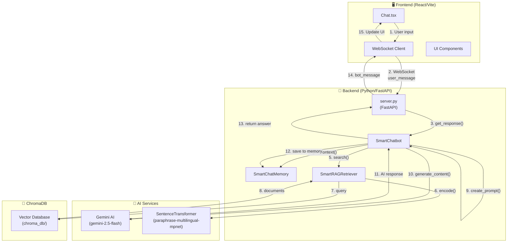
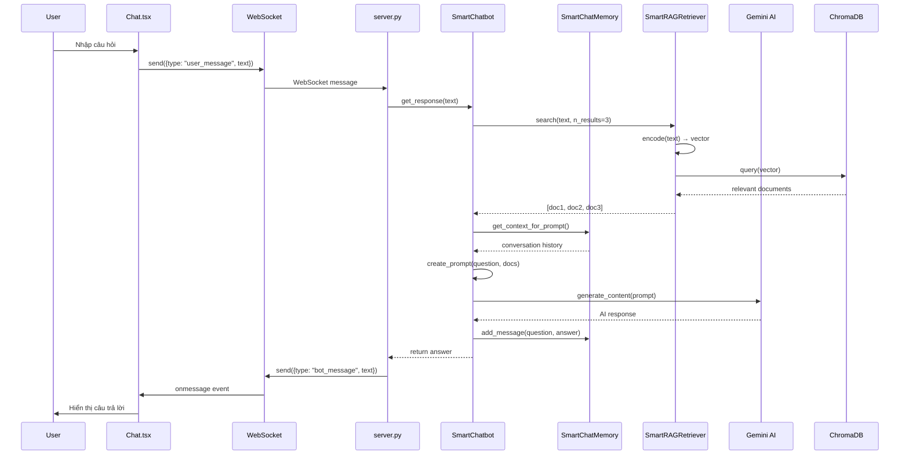
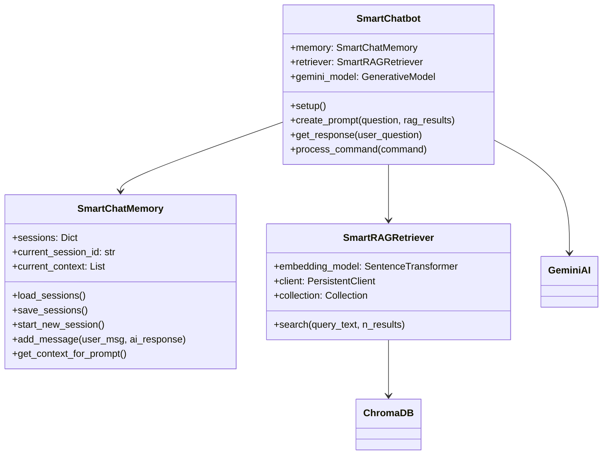
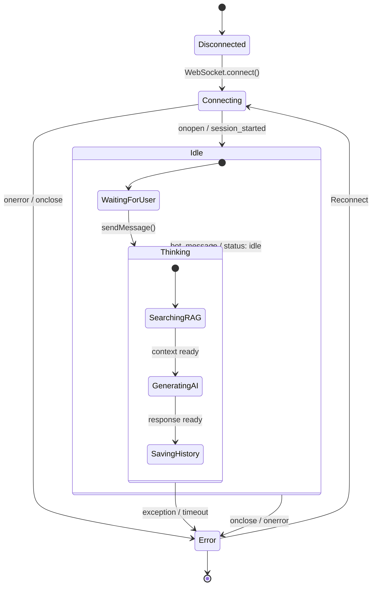

# Architecture Flow Diagram


## Tổng quan kiến trúc



---

## Chi tiết các Class

### Frontend

| Component | File | Chức năng |
|-----------|------|-----------|
| `Chat` | `Chat.tsx` | UI chat, quản lý WebSocket, render messages |
| `ChatMessage` | `Chat.tsx` | Interface cho tin nhắn (id, role, text) |

### Backend

| Class | File | Chức năng |
|-------|------|-----------|
| `FastAPI app` | `server.py` | HTTP/WebSocket server |
| `SmartChatbot` | `smart_chatbot.py` | Điều phối chính: Memory + RAG + AI |
| `SmartChatMemory` | `smart_chatbot.py` | Lưu trữ lịch sử chat theo session |
| `SmartRAGRetriever` | `smart_chatbot.py` | Tìm kiếm documents trong ChromaDB |

---

## Luồng xử lý chi tiết



---

## WebSocket Protocol

### Messages từ FE → BE

```json
{"type": "new_session"}
{"type": "user_message", "text": "...", "session_id": "..."}
{"type": "ping"}
```

### Messages từ BE → FE

```json
{"type": "session_started", "session_id": "..."}
{"type": "status", "status": "thinking|idle"}
{"type": "bot_message", "text": "...", "session_id": "..."}
{"type": "error", "error": "...", "message": "..."}
```

---

## Class Diagram



---

## State Chart (Biểu đồ trạng thái)

Biểu đồ này mô tả các trạng thái của hệ thống và điều kiện chuyển đổi.



